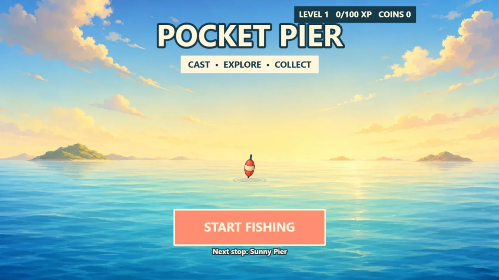
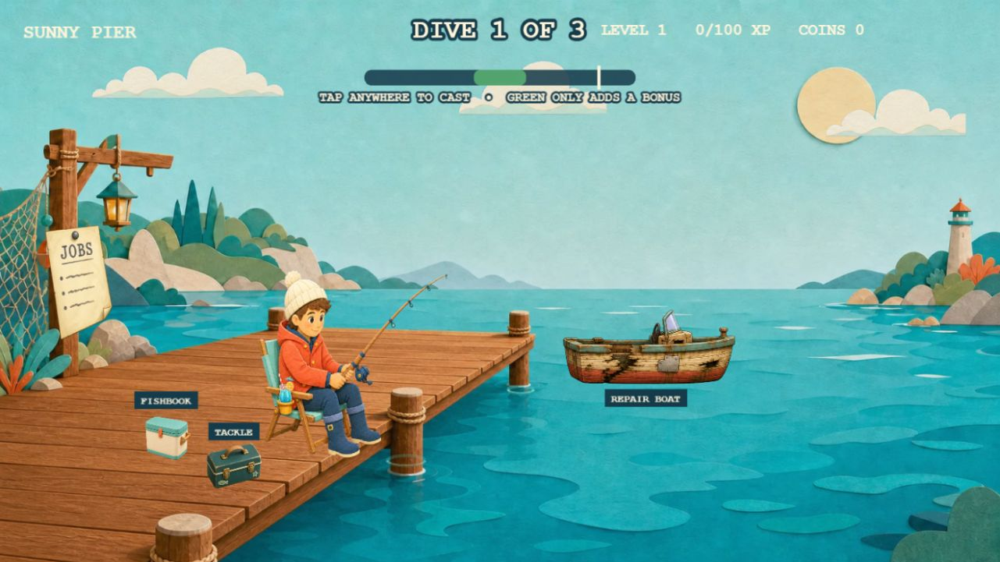
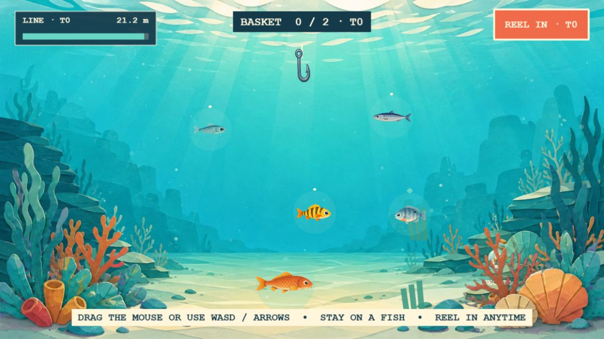
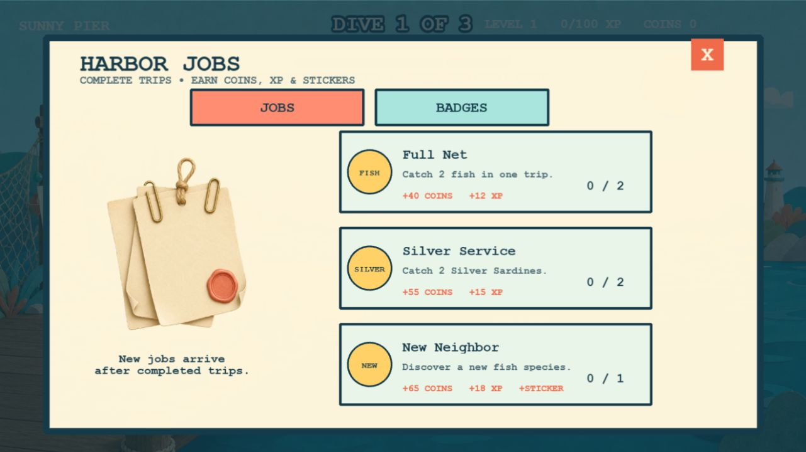

# Pocket Pier

Pocket Pier is a small, cozy browser fishing game built with Phaser 3 and TypeScript. Cast from the harbor, steer the hook through three underwater locations, discover fish and treasures, complete Harbor Jobs, upgrade your tackle, and repair the boat to reach deeper waters.

**[Play the current build on GitHub Pages](https://emfau88.github.io/PocketPier/)**

Desktop and mobile browsers are supported. Mobile play is designed for landscape orientation.



## Current project status

Pocket Pier is a playable vertical slice with its full three-area progression loop implemented. It is not presented here as a finished commercial release: portal preview testing, real-device QA, preview videos, and the remaining audio/platform-mute work are still open.

| Area | Current state |
| --- | --- |
| Core loop | Three-dive trips, casting, underwater steering, catching, reeling, coins, XP, records, and rewards are playable |
| Locations | Sunny Pier, Rocky Cove, and Moonlit Trench; unlocked areas remain replayable |
| Collection | 16 fish species and 9 treasures across the three locations |
| Progression | 15 player levels, four equipment paths, three boat-repair stages, location mastery, and save migration |
| Long-term goals | 15 Harbor Jobs and 13 manually claimable badges with visible progress |
| Cosmetics | Four badge-unlocked bobber color styles plus harbor/cooler sticker progression |
| Platforms | Responsive desktop and mobile-landscape layouts with mouse, keyboard, and touch controls |
| Saving | Local browser saves plus CrazyGames Data Module support when the SDK is available |
| Portal work | CrazyGames HTML5 v3 bridge, lifecycle events, completion/context reporting, and safe ad fallback are implemented |
| Verification | 37 deterministic tests; production build currently about 3.9 MB across 67 files |

## Gameplay



The harbor is the progression hub. From here the player can:

- open the Fishbook and treasure collection;
- inspect and buy line, reel, basket, and bait upgrades;
- review and manually claim Harbor Jobs and badges;
- repair the boat in three stages;
- select any unlocked fishing location by clicking the angler.

Each location has its own fish roster and underwater behavior. Sunny Pier introduces the controls, Rocky Cove adds currents and obstacles, and Moonlit Trench uses reduced visibility and more demanding fish movement.



The cast timing bar is optional: every valid input casts the line, while landing in the green zone only improves reward chances. Underwater, the player guides the hook, stays on a fish long enough to catch it, manages line and basket capacity, and can reel in at any time.

## Jobs, badges, and rewards



Completed jobs and badges wait for the player to claim them manually. Claiming awards coins and XP through animated reward feedback. Trips also feed location mastery, collection progress, level rewards, boat access, stickers, and bobber-style unlocks.

## Controls

| Action | Desktop | Mobile landscape |
| --- | --- | --- |
| Cast | Click or press Space | Tap; the green window grants a bonus |
| Steer underwater | Hold and move the mouse, WASD, or arrow keys | Hold and drag the floating joystick |
| Catch a fish | Keep the hook inside the catch ring | Keep the hook inside the catch ring |
| Reel in | E, Space, or the Reel In button | Tap Reel In |
| Open harbor menus | Click the labeled harbor objects | Tap the labeled harbor objects |

First-time players receive short cast, harbor, and mobile-steering guidance. The HUD exposes remaining line as both a colored bar and a numeric distance.

## Technical overview

- Phaser 3.90, TypeScript 5, and Vite 6
- Dynamic high-DPI rendering with crisp Phaser text
- Full-viewport cover scaling, safe-area-aware HUD layout, and compact mobile dialogs
- Staged asset loading: menu, shared harbor assets, then the selected location
- Optimized WebP runtime artwork; high-resolution source art is kept separately
- Phaser isolated into a cacheable vendor chunk
- CrazyGames HTML5 v3 SDK isolated behind `PortalBridge`, with a local fallback
- Versioned save schema, currently version 9
- Reduced-motion support and a portrait rotation notice

The production build is deliberately small enough for web portals and mobile delivery. The repository also contains reproducible scripts for runtime assets, economy simulation, and exact-size store covers.

## What is still open

Before calling the project release-ready, the following work remains:

- record the required genuine 15–20 second landscape and portrait preview videos;
- run the uploaded build through the CrazyGames Preview environment;
- complete physical Safari/iOS, Android, Chromebook, and refresh-rate device checks;
- finish audio ambience/settings, iOS resume behavior, CrazyGames platform mute, and ad mute/unmute handling;
- perform final retention and economy tuning from real-player data;
- complete the external portal submission and Basic Launch review.

Music and ambience are not yet a finished system. Event sound effects exist, but the full audio/settings pass is intentionally still marked as incomplete.

## Local development

Requirements: Node.js 22 or newer and npm.

```bash
npm install
npm run dev
```

Vite prints the local URL, normally `http://127.0.0.1:5174/` or `http://localhost:5173/`.

### Verification

```bash
npm test
npm run build
npm run balance:sim
```

- `npm test` runs gameplay, progression, quest, badge, save-migration, responsive-layout, and touch-control regressions.
- `npm run build` type-checks the project and creates the deployable `dist/` directory.
- `npm run balance:sim` checks the intended early upgrade and boat-repair economy.

## Project structure

```text
src/core/       save data, rendering, audio, assets, and portal integration
src/gameplay/   fish, locations, quests, cosmetics, balance, and input rules
src/scenes/     menu, loading, harbor, underwater gameplay, and trip summary
src/assets/     generated source artwork and optimized runtime assets
tests/          deterministic regression tests
scripts/        asset, store-cover, and economy tooling
docs/           roadmap, design notes, screenshots, and submission material
```

## Deployment and release documents

Every push to `master` runs the GitHub Pages workflow and deploys `dist/` to:

**https://emfau88.github.io/PocketPier/**

- [Release roadmap](docs/RELEASE_ROADMAP.md)
- [CrazyGames submission package and checklist](docs/store/CRAZYGAMES_SUBMISSION.md)
- [Store covers](docs/store/)
- [Art direction and asset plan](docs/ART_DIRECTION_AND_ASSET_PLAN.md)
